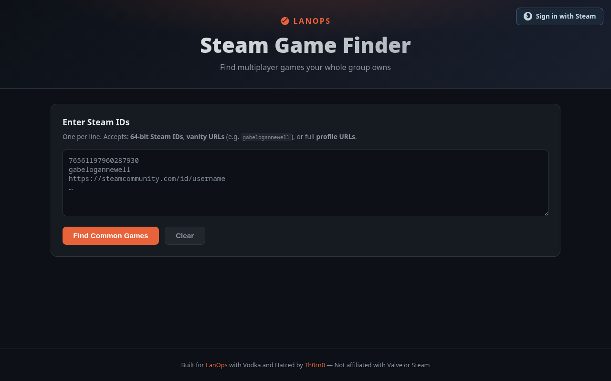
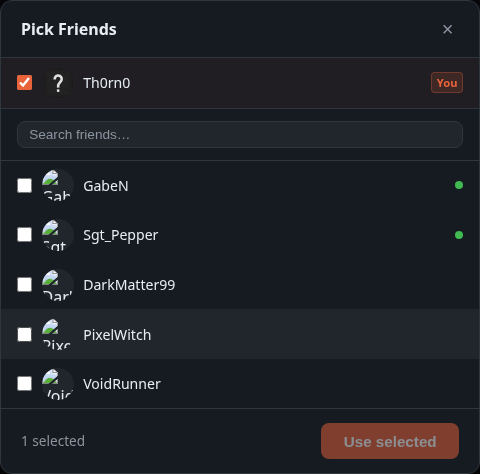
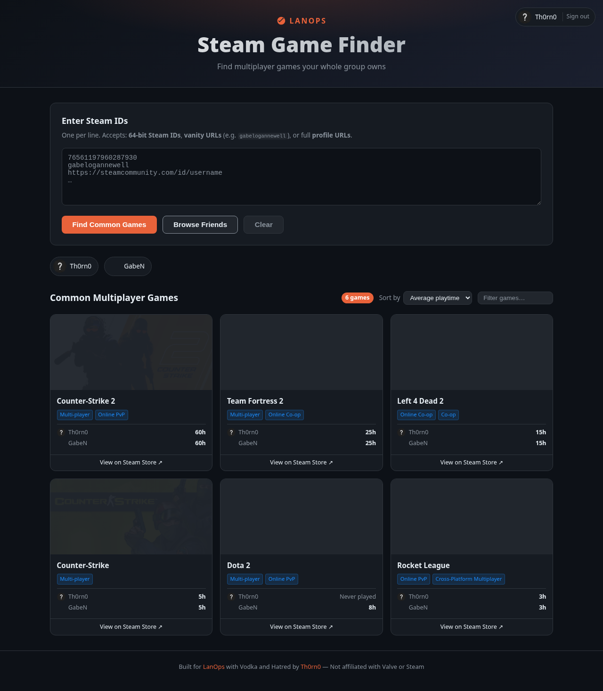
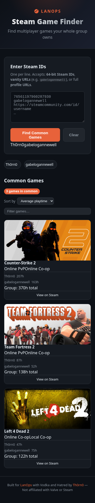
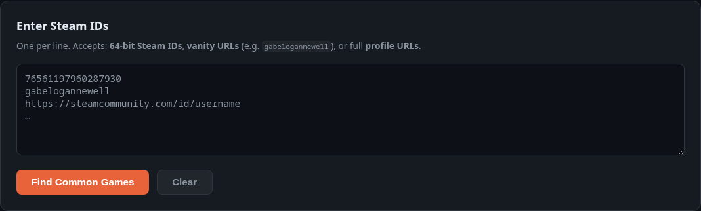

# LanOps Steam Game Finder

Find multiplayer games your whole group owns on Steam. Paste in a list of Steam IDs or vanity URLs, and the app compares everyone's libraries in real time, filtering down to games with multiplayer support that every person owns.

Built with Vodka and Hatred by [Th0rn0](https://www.th0rn0.co.uk) for [LanOps](https://www.lanops.co.uk).



---

## Features

- **Common game finder** — intersects multiple Steam libraries and filters to multiplayer-only titles
- **Real-time progress** — server-sent events stream progress as libraries are fetched and checked
- **Steam login** — sign in with your Steam account to pick friends directly from your friend list
- **Friend picker** — searchable modal with online status indicators; includes yourself by default
- **Flexible input** — accepts 64-bit Steam IDs, vanity URLs, and full profile URLs interchangeably
- **Playtime breakdown** — shows each player's hours per game, sorted by group total playtime
- **Private account handling** — private/inaccessible accounts are excluded gracefully with a warning
- **Game detail caching** — store API results are cached locally for 30 days to keep things fast
- **Filter and sort** — filter by name, sort by playtime or alphabetically

---

## Screenshots

| Landing page | Friend picker |
|---|---|
|  |  |

| Results | Mobile |
|---|---|
|  |  |

> To regenerate screenshots: install `bun`, then run `bun run screenshots` (coming soon).

---

## Prerequisites

- [Node.js](https://nodejs.org/) 18 or later
- A [Steam Web API key](https://steamcommunity.com/dev/apikey) (free, instant)

---

## Quick Start

### 1. Clone and install

```bash
git clone https://github.com/th0rn0/lanops-steam-game-finder.git
cd lanops-steam-game-finder
npm install
```

### 2. Configure environment

```bash
cp .env.example .env
```

Open `.env` and fill in your values:

```env
# Required — get yours at https://steamcommunity.com/dev/apikey
STEAM_API_KEY=your_steam_api_key_here

# Port to listen on (default: 3000)
PORT=3000

# Full public URL of this instance — used for Steam OpenID callback
# Change this if you're running behind a reverse proxy or on a non-standard port
BASE_URL=http://localhost:3000

# Secret for signing session cookies — change this in production
SESSION_SECRET=change-me-in-production
```

### 3. Run

```bash
npm run dev      # development — auto-restarts on file changes
npm start        # production
```

Open [http://localhost:3000](http://localhost:3000).

---

## Usage

### Without a Steam account

Paste Steam IDs or usernames into the text area, one per line, then click **Find Common Games**.

Accepted formats:

```
76561197960287930
gabelogannewell
https://steamcommunity.com/id/gabelogannewell
https://steamcommunity.com/profiles/76561197960287930
```

You need at least two entries. The app resolves vanity URLs automatically.



### With Steam login

Click **Sign in with Steam** in the top right. After authenticating, a **Browse Friends** button appears next to the search input.


The friend picker lets you:

- Include yourself with the **You** checkbox at the top (checked by default)
- Search friends by name
- See who is currently online (green dot)
- Select any combination, then click **Use selected** to populate the input


The **Use selected** button is only enabled once you have at least 2 people selected.

### Reading the results

Games are sorted by total group playtime by default. Each card shows:

- Game header image
- Multiplayer category tags (Online Co-op, Local PvP, etc.)
- Per-player playtime, or "Never played" for zero hours
- Link to the Steam store page

Use the **Sort by** dropdown and the **Filter** input to narrow results.


---

## Running with Docker

### Pull and run

```bash
docker run -d \
  -p 3000:3000 \
  -e STEAM_API_KEY=your_key_here \
  -e SESSION_SECRET=your_secret_here \
  -e BASE_URL=http://your-server:3000 \
  --name lanops-steam-game-finder \
  th0rn0/lanops-steam-game-finder:latest
```

### Build locally

```bash
docker build -t lanops-steam-game-finder .
docker run -d -p 3000:3000 \
  -e STEAM_API_KEY=your_key_here \
  -e SESSION_SECRET=your_secret_here \
  lanops-steam-game-finder
```

### With a persistent game cache

```bash
docker run -d \
  -p 3000:3000 \
  -e STEAM_API_KEY=your_key_here \
  -e SESSION_SECRET=your_secret_here \
  -v $(pwd)/cache:/app/cache \
  th0rn0/lanops-steam-game-finder:latest
```

---

## Configuration

All configuration is via environment variables.

| Variable | Required | Default | Description |
|---|---|---|---|
| `STEAM_API_KEY` | Yes | — | Steam Web API key from [steamcommunity.com/dev/apikey](https://steamcommunity.com/dev/apikey) |
| `PORT` | No | `3000` | Port the HTTP server listens on |
| `BASE_URL` | No | `http://localhost:PORT` | Public-facing URL — must match the registered Steam OpenID return URL |
| `SESSION_SECRET` | No | `lanops-secret` | Secret for signing session cookies. Change this in any non-local deployment. |

### Steam API key

1. Go to [https://steamcommunity.com/dev/apikey](https://steamcommunity.com/dev/apikey)
2. Log in with your Steam account
3. Enter any domain name (e.g. `localhost` for local use)
4. Copy the key into `STEAM_API_KEY`

### BASE_URL and Steam login

Steam's OpenID flow redirects back to `BASE_URL/auth/steam/return`. If you deploy behind a reverse proxy or on a non-standard port, set `BASE_URL` to the public URL users hit, for example:

```env
BASE_URL=https://games.yourdomain.com
```

Mismatched `BASE_URL` will cause Steam login to fail with a redirect mismatch error.

---

## Reverse Proxy

### nginx

```nginx
server {
    listen 80;
    server_name games.yourdomain.com;

    location / {
        proxy_pass http://127.0.0.1:3000;
        proxy_http_version 1.1;
        proxy_set_header Upgrade $http_upgrade;
        proxy_set_header Connection '';
        proxy_set_header Host $host;
        proxy_set_header X-Real-IP $remote_addr;
        # Required for SSE (server-sent events) — disables buffering
        proxy_buffering off;
        proxy_cache off;
        chunked_transfer_encoding on;
    }
}
```

The `proxy_buffering off` line is important. Without it, nginx buffers the SSE stream and progress updates won't appear in real time.

---

## Development

### Project structure

```
lanops-steam-game-finder/
├── server.js          # Express app, Steam API calls, SSE endpoint
├── auth.js            # Steam OpenID passport strategy and auth routes
├── public/
│   ├── index.html     # Single-page UI
│   ├── app.js         # Frontend JS — search flow, friend picker, rendering
│   └── style.css      # All styles
├── tests/
│   ├── setup.js       # Jest environment variables
│   ├── unit/
│   │   └── helpers.test.js       # isMultiplayer, Semaphore, normaliseSteamInput
│   ├── integration/
│   │   └── api.test.js           # API endpoint tests with mocked Steam API
│   └── frontend/
│       └── app.test.js           # Frontend utility and logic tests
├── __mocks__/
│   └── passport-steam.js  # Manual mock for auth tests
├── Dockerfile
├── .drone.yml
└── .env.example
```

### Running tests

```bash
npm test              # run all tests once
npm run test:watch    # watch mode
```

The test suite has 59 tests across three suites:

- **Unit** (`tests/unit/`) — pure function tests for `isMultiplayer`, `Semaphore`, and `normaliseSteamInput`
- **Integration** (`tests/integration/`) — API endpoint tests with the Steam API intercepted by nock
- **Frontend** (`tests/frontend/`) — XSS escaping, SSE chunk parsing, sort/filter logic

Tests use `jest`, `supertest`, and `nock`. No network calls are made during the test run.

### How the search works

1. Inputs are resolved to 64-bit Steam IDs (vanity URLs hit `ResolveVanityURL`)
2. `GetPlayerSummaries` checks visibility — private accounts are excluded
3. `GetOwnedGames` fetches each public account's library in parallel
4. The app intersects all libraries to find common app IDs
5. Each common app is checked against `store.steampowered.com/api/appdetails` for multiplayer categories
6. Results stream back to the browser via SSE as each step completes

Game detail lookups are cached in `cache/game-details.json` for 30 days.

### Adding a multiplayer category

The list of Steam category IDs that count as multiplayer is in `server.js`:

```js
const MULTIPLAYER_CATEGORY_IDS = new Set([
  1,  // Multi-player
  9,  // Co-op
  24, // Shared/Split Screen
  27, // Cross-Platform Multiplayer
  36, // Online PvP
  38, // Online Co-op
  47, // Local Co-op
  48, // Local PvP
  49, // PvP
]);
```

Add a Steam category ID to this set to include it.

---

## CI/CD

The project uses [Drone CI](https://www.drone.io/) with the following pipeline (`.drone.yml`):

| Stage | Trigger | What it does |
|---|---|---|
| Lint | All events | `node --check` on server and frontend JS |
| Test | All events | `npm ci && npm test` |
| Build & Push | `main` branch + tags | Builds Docker image, pushes to `th0rn0/lanops-steam-game-finder` on DockerHub |
| Smoke test | `main` branch + tags | Pulls the just-built image, starts it with dummy env vars, polls `GET /api/me` |
| GitHub Release | Tags only | Creates a GitHub release using `VERSION` file |

Discord notifications fire on start/success/failure for each stage.

### Required Drone secrets

| Secret | Description |
|---|---|
| `discord_webhook_url` | Discord webhook for build notifications |
| `dockerhub_username` | DockerHub username |
| `dockerhub_token` | DockerHub access token |
| `github_token` | GitHub personal access token (for release creation) |

### Releasing a new version

1. Update `VERSION` with the new version number
2. Commit and tag: `git tag v1.2.3 && git push --tags`
3. Drone builds and pushes the image, creates the GitHub release automatically

---

## Private accounts

Steam's API enforces privacy settings server-side. If a player has their game library set to private, `GetOwnedGames` returns an empty response and the account is excluded from the comparison with a warning.

The only workaround is for the player to temporarily set their **Game details** visibility to **Public** in Steam: `Profile → Edit Profile → Privacy Settings → Game details → Public`.

---

## License

MIT
